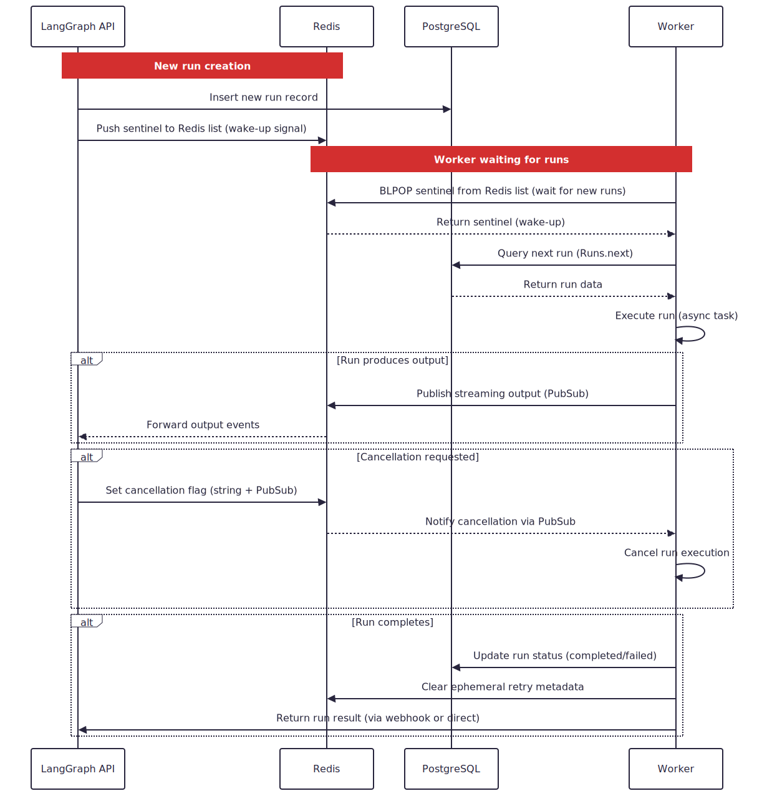
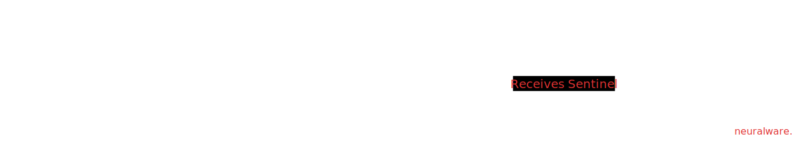

In How to Build and Deploy an AI Agent using LangGraph from Scratch, we deployed an AI agent to a standalone container running the LangGraph server. This setup communicates with both PostgreSQL and Redis. In that architecture, PostgreSQL serves as a checkpointer - responsible for persisting agent state across interactions, allowing the agent to "remember" previous conversations.

However, the role of Redis may have felt less clear. It's briefly described as a task orchestrator and a channel for streaming output, but beyond that, LangGraph’s documentation doesn't dive deep into its purpose or inner workings.

One of the advantages of using open-source software is transparency - we can inspect the implementation to truly understand what's going on under the hood. So that's exactly what I did. ^[LangGraph doesn't publish source code for `langgraph-storage`, but only wheels. So you have to install the package to view the code. The  implementation is present in `langgraph_storage.queue`]

In this article, we'll explore how Redis fits into the LangGraph architecture and how it plays a crucial role in enabling fault-tolerant, stateful conversational AI applications, especially when working alongside PostgreSQL and the LangGraph server.

## Redis in LangGraph

At its core, Redis serves as LangGraph's high-performance messaging backbone, enabling two critical capabilities:

- Task queuing with retry counts for fault-tolerant agent workflows
- Real-time streaming of intermediate agent outputs


Unlike traditional databases, Redis specializes in low-latency operations through its in-memory data structures. For LangGraph, this means:

- **Redis List** act as FIFO queues for agent task scheduling
- **Redis String and Pub/Sub** for bi-directional signaling (output streaming / cancellations)
- **Blocking Queues** create reliable queues that survive worker crashes

These concepts will be clear once we start looking into the internal working.

:::{.callout-note}
By using Redis as a message broker, LangGraph decouples the components that produce runs (agents/servers) from the workers that execute them.
:::

### Duality

A key architectural advantage is Redis' ability to function as both a queue and a broadcast system simultaneously. When your LangGraph agent processes a request:

- PostgreSQL persists the final state (the "what")
- Redis orchestrates the execution path (the "how") through:
    - Atomic task^[Atomic tasks means, they either complete fully or not at all] handoffs between components
    - Non-blocking progress updates to clients
    - Automatic retries for failed operations

This explains why LangGraph requires both databases - while PostgreSQL provides durability, Redis delivers the coordination layer that makes stateful, long-running agent workflows possible.

## Under the hood

The following sequence diagram captures the key interactions and the role of Redis as a messaging and signaling layer, with Postgres as the durable run data store. 

{#fig-langgraph-redis}

#### Explanation

The Agent creates a new run by inserting it into Postgres and signals workers^[Workers in this context are async tasks in Python, they have nothing to do with Redis.] via a sentinel^[A sentinel is a special placeholder or signal value used within a Redis list to notify workers - it has no actual run info. Not to be confused with Redis Sentinel (the high-availability system).] pushed to a Redis list.

1. The Worker blocks on Redis list (BLPOP^[In a basic queue, if a consumer tries to dequeue a task when the queue is empty, it gets a null response and may need to poll the queue repeatedly. To avoid this, Redis provides a way to implement blocking queues. In a blocking queue, if a consumer tries to dequeue a task when the queue is empty, it is put to sleep by Redis until a task is available.]) waiting for a wake-up signal.
2. Upon receiving the signal, the worker fetches the actual run data from Postgres.
3. The worker executes the run asynchronously.
4. During execution, the worker streams output events via Redis PubSub to the agent.
5. If a cancellation is requested, the agent sets a cancellation flag in Redis, which is communicated to the worker via PubSub channel.
6. Upon completion, the worker updates the run status in Postgres, clears ephemeral metadata in Redis, and notifies the agent (e.g., via webhook).


## Crash Resilience

The key to LangGraph’s fault-tolerance lies in how it uses Redis lists as a _transactional queue_. This is achieved via `BLPOP` and Atomic Task Handoffs.

### Crash-Safe Task Claiming

When a worker executes a `BLPOP tasks: queue 0` (as shown in the sequence diagram), the operation is **atomic**:

- Redis only removes the task from the list **after** it has been delivered to the worker.
- If the worker crashes **before** processing the task, the task remains in the queue.

This ensures that no task is lost due to unexpected crashes or restarts. Additionally, LangGraph sets a sensible default for concurrency control:

```{.sh}
N_JOBS_PER_WORKER = env("N_JOBS_PER_WORKER", cast=int, default=10)
```

Each worker will process up to 10 tasks in parallel unless configured otherwise, helping scale horizontally while keeping workloads isolated.

### The Sentinel Pattern

In the diagram, you may have noticed agents pushing a sentinel - a wake-up signal - into Redis. 

{#fig-sentinel-pattern}

Here's how it works: 

- Workers use `BLPOP` with a timeout of `0`, meaning they block indefinitely until a signal arrives.
- This design eliminates the need for polling and ensures no messages are missed - even if a worker restarts.

LangGraph also reports internal metrics periodically to help with observability:

```{.sh}
STATS_INTERVAL_SECS = env("STATS_INTERVAL_SECS", cast=int, default=60)
```

This allows systems to track worker health and performance at one-minute intervals by default.

### PostgreSQL as a Fallback

If Redis is temporarily unavailable or restarts, LangGraph falls back to PostgreSQL via `Runs.next`, as shown in the query step of the diagram.

This creates a two-layered recovery mechanism:

- **Redis-first** (hot path): Fast, in-memory task delivery.
- **PostgreSQL** (cold path): Durable, persistent task storage.

This layered approach ensures resilience without sacrificing performance. LangGraph also sets an upper bound on how long a background task can run:

```{.sh}
BG_JOB_TIMEOUT_SECS = env("BG_JOB_TIMEOUT_SECS", cast=float, default=3600)
```

This ensures that long-running or stuck jobs don't hang forever - by default, any job exceeding 1 hour is forcefully timed out.

### Why This Beats Polling

Polling-based systems often suffer from subtle timing issues. For instance, if a worker uses RPOP^[RPOP: Redis command to dequeue an element (FIFO)] to dequeue a task and then crashes before it begins processing, that task is effectively lost. Similarly, network hiccups or buffering delays can cause tasks to be silently dropped or missed altogether.

LangGraph avoids these pitfalls by using BLPOP, which blocks server-side until a task is available. This means tasks remain in Redis until they are actually handed off to a live worker. There are no polling loops, no race conditions, and no dependency on fragile network timing - just clean, atomic task delivery.

## Putting it All Together

In summary, LangGraph cleverly integrates Redis not just as a simple cache, but as a core component for resilient task orchestration and real-time communication. By leveraging atomic operations like `BLPOP` for crash-safe task claiming and Pub/Sub for efficient signaling and output streaming, it builds a robust system that complements PostgreSQL's role in state persistence. This dual-database approach allows LangGraph to deliver performant, fault-tolerant execution for complex, stateful AI agent workflows, ensuring tasks are reliably processed even amidst potential failures.

## References

1. [Redis Queue](https://redis.io/glossary/redis-queue/)
2. [LangGraph: How we use Redis](https://langchain-ai.github.io/langgraph/concepts/platform_architecture/#how-we-use-redis)